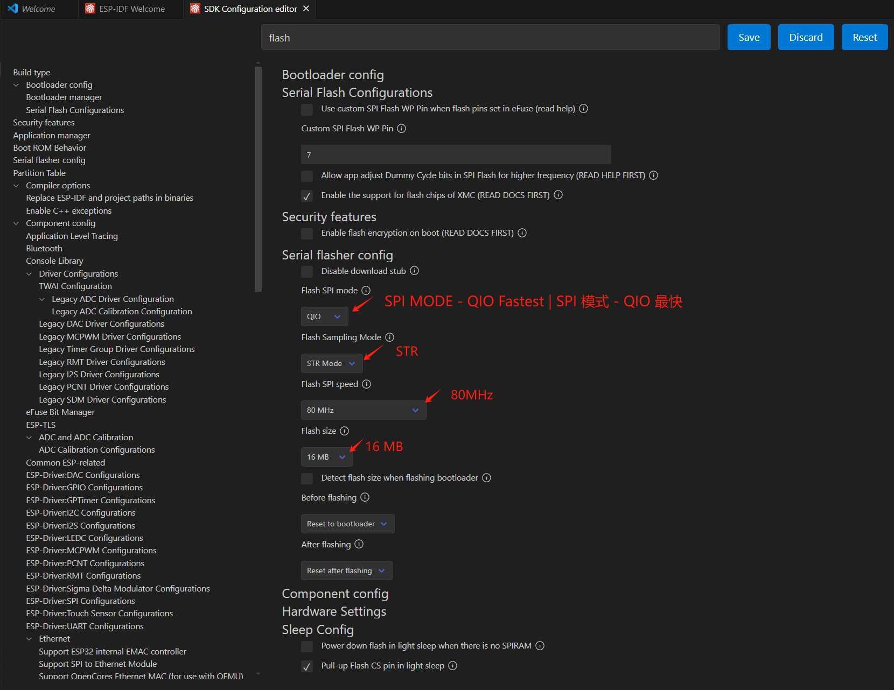
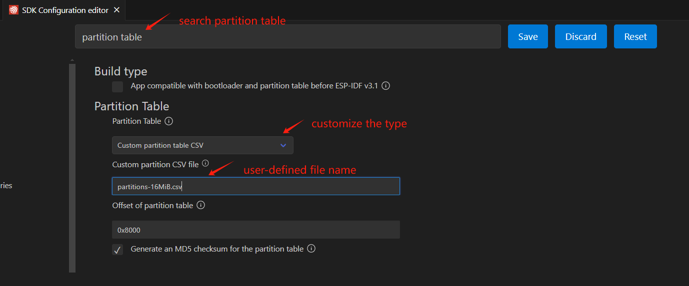
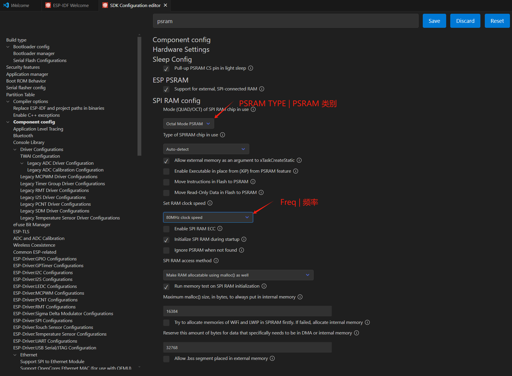
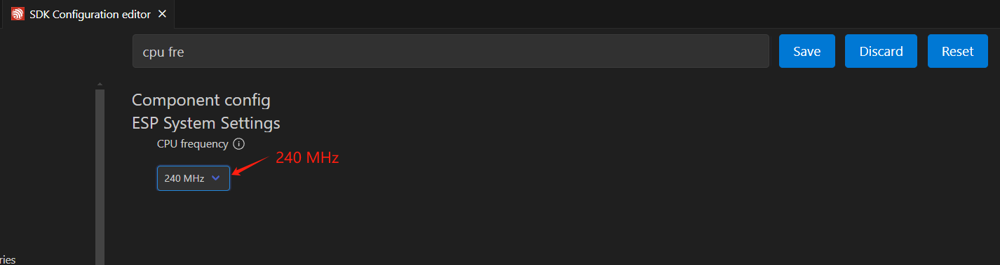
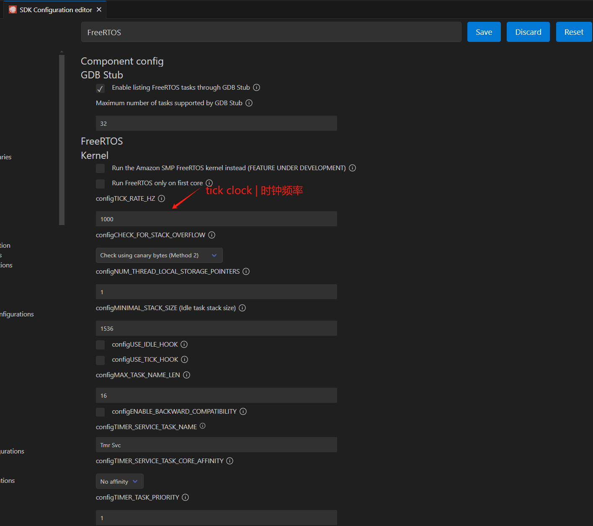

# GET STARTED

!!! tip
    This chapter is about how to make this project from scratch.

## PROJECT CREATION

Assuming you have installed the necessary tools, let's start by creating a new project. 

### Step 1: Create the New Project

Navigate to the directory where you want to create the project and run the following command to activate the idf environment (if you have properly setup as indicated in the official guidance):

```bash
get_idf
```

Then, create the project ("DNESP32S3-INIT") by running the following command:

```bash
idf.py create-project DNESP32S3-INIT
```

### Step 2: Setup the Target

Then, navigate to the project directory:

```bash
cd DNESP32S3-INIT
```

Then, set the target to the development board (here, the chip we are using is ESP32-S3):

```bash
idf.py set-target esp32s3
```
### Step 3: Compile and Flash the Project

Then, compile the project:

```bash
idf.py build
```

Then, flash the project:

```bash
idf.py flash
```

By far, we have made a quick and dirty project. Next, we will configure the project.

## PROJECT CONFIGURATION AS TEMPLATE

### Step 1: Preprocess

Before we dive deeper, let's clean the project by conducting 'fullclean':

```bash
idf.py fullclean
```

Alternatively, you can manually delete the 'build' folder.

For convenience, I renamed the entrance c file as `main.c`, and accordingly, I modified the `CMakeLists.txt` under the `main` folder. Then I recompiled and reflashed the project, everything looks good.

Note that, so far, the project is compiled according to default ESP32 setup rather than the specifications of the development board, to maximize the performance of the board, we need to configure the project according to the board's specifications. You can refer to the setup guidance provided by the board manufacturer. Herein, we do this according to the guidance from Alientek.

### Step 2: Adaptive Configuration

!!! note
    This step is to configure the project settings to maximize the power of the hardware, i.e., use target-specific configurations rather than default configurations.
!!! warning
    Before you open the project configuration UI, make sure you have the project open in VSCode, **set the target to your board**, and have the ESP-IDF extension installed.

1. Enter the project configuration UI by pressing `Ctrl+Shift+P` (Windows/Linux) or `Cmd+Shift+P` (macOS) and type `ESP-IDF: Configure Project`. Alternatively, one can click the gear icon on the bottom menu of the VSCode window.
{ width=800px }
2. 'FLASH' configuration. In the search bar, type `flash` and press `Enter`. 
{ width=800px }
3. 'Partition Table' configuration. In the search bar, type `partition` and press `Enter`.
{ width=800px }
details to be provided later
4. 'PSRAM' configuration. In the search bar, type `psram` and press `Enter`.
{ width=800px }
5. Change the CPU frequency. In the search bar, type `cpu` and press `Enter`. Modify the CPU frequency to 240 MHz.
{ width=600px }
6. Modify the FreeRTOS tick clock frequency. In the search bar, type `tick` and press `Enter`. Modify the tick clock frequency to 1000 Hz.
{ width=600px }
7. Modify the partition table. In the command palette, type `ESP-IDF: Open Partition Table Editor UI`.
{ width=500px }
8. Modify the partition table as shown below.
{ width=800px }
9. Save the all the modifications.

The configuration is now consistent with the hardware onboard resources. 

