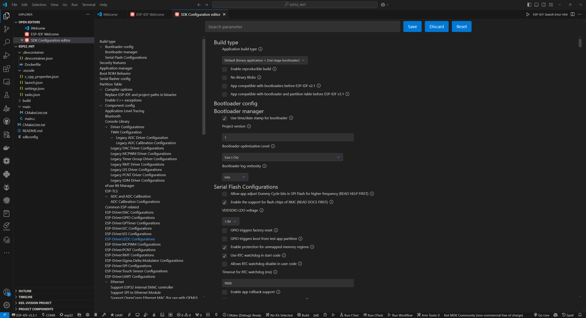
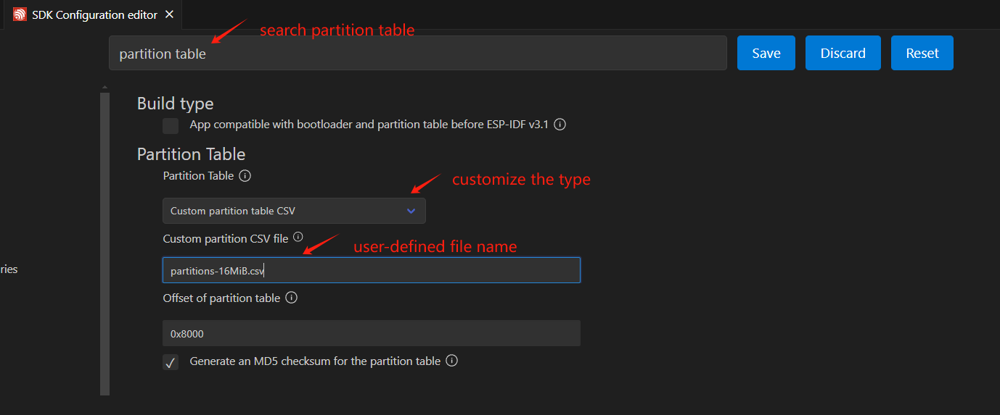
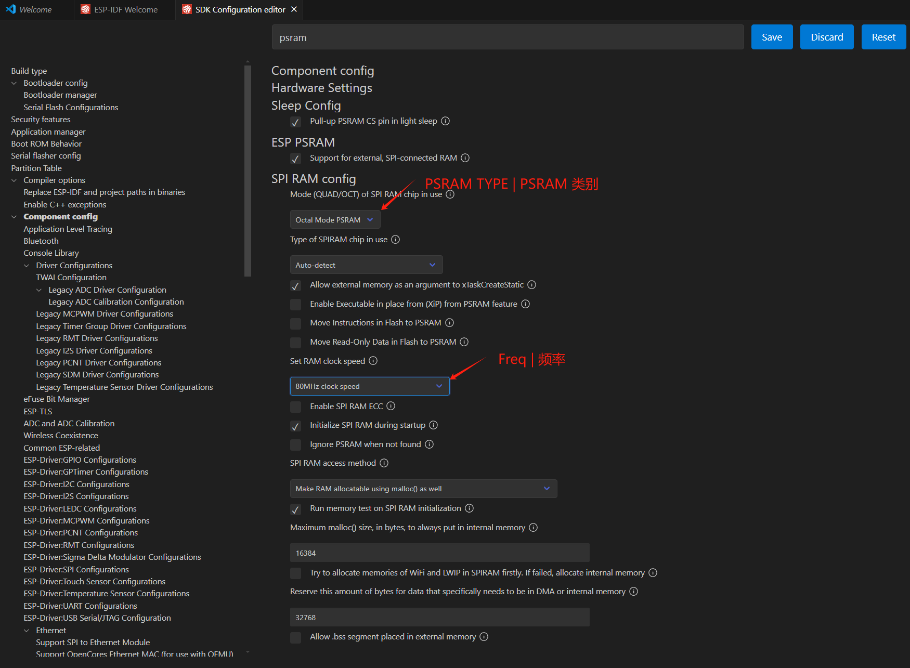
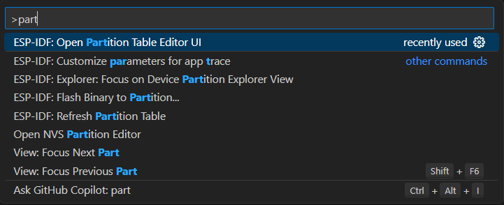
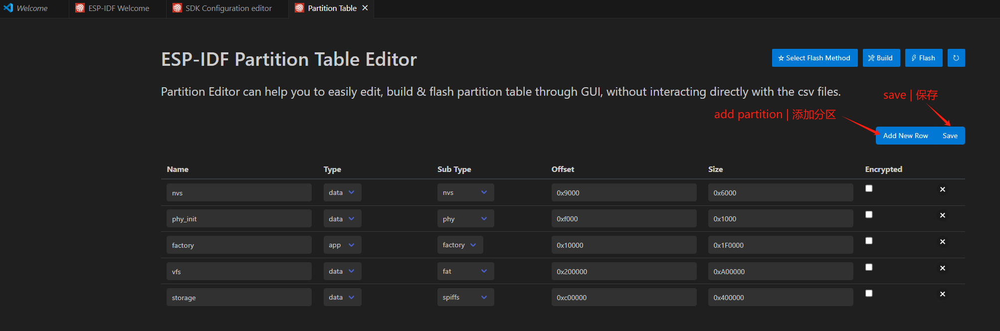

# 快速上手

!!! tip
    本节旨在介绍如何从零开始创建一个项目。

## 创建项目

假设你已经安装了必要的工具，让我们开始创建一个新项目。

### 第 1 步：创建新项目

导航到你想要创建项目的目录，并运行以下命令激活 idf 环境（如果你已经按照官方指导正确设置）：

```bash
get_idf
```

然后，通过运行以下命令创建项目（"DNESP32S3-INIT"）：

```bash
idf.py create-project DNESP32S3-INIT
```

### 第 2 步：设置目标设备

然后，导航到项目目录：

```bash
cd DNESP32S3-INIT
```

然后，将目标设备设置为开发板（这里，我们使用的芯片是 ESP32-S3）：

```bash
idf.py set-target esp32s3
```

### 第 3 步：编译和烧写项目

然后，编译项目：

```bash
idf.py build
```

然后，烧写项目：

```bash
idf.py flash
```

到目前为止，我们已经创建了一个快速而简单的项目。接下来，我们将配置项目。

## 项目配置为模板

### 第 1 步：预处理

在我们更为深入之前，我们首先通过执行 'fullclean' 来清理项目：

```bash
idf.py fullclean
```

或者，你也可以手动删除`build`文件夹。

为了方便起见，我把入口文件改名为`main.c`，相应地，我把`main`文件夹下面的 `CMakeLists.txt` 也做了相应修改。之后，我重新编译和烧录了项目，看起来比较正常。

注意，到目前位置，整个项目是按照ESP32默认的设置来进行配置而不是根据板子的实际情况来配置的。为了最大化利用板子的资源，我们需要对项目进行配置。可以参考板子制造商的说明进行。

### 第 2 步：针对性配置

!!! note
    这一步是为了配置项目设置以最大化硬件的性能，即使用特定于目标的配置而不是默认配置。

!!! warning
    在打开项目配置 UI 之前，请确保您已在 VSCode 中打开了项目，**将目标设置为对应的板子**，并安装了 ESP-IDF 扩展。

1. 通过按 `Ctrl+Shift+P`（Windows/Linux）或 `Cmd+Shift+P`（macOS）并输入 `ESP-IDF: Configure Project` 进入项目配置 UI。或者，可以点击 VSCode 窗口底部菜单的齿轮图标。
{ width=800px }
2. 'FLASH' 配置。在搜索栏中输入 `flash` 并按 `Enter`。
{ width=800px }
3. 'Partition Table' 配置。在搜索栏中输入 `partition` 并按 `Enter`。
{ width=800px }
详细信息稍后提供
4. 'PSRAM' 配置。在搜索栏中输入 `psram` 并按 `Enter`。
{ width=800px }
5. 更改 CPU 频率。在搜索栏中输入 `cpu` 并按 `Enter`。将 CPU 频率修改为 240 MHz。
{ width=600px }
1. 修改 FreeRTOS tick 时钟频率。在搜索栏中输入 `tick` 并按 `Enter`。将频率修改为 1000。
{ width=600px }
1. 修改分区表。在命令面板中输入 `ESP-IDF: Open Partition Table Editor UI`。
{ width=500px }
1. 修改分区表如下所示。
{ width=800px }
1. 保存所有修改。

到目前为止，配置信息现在与硬件板上资源一致。